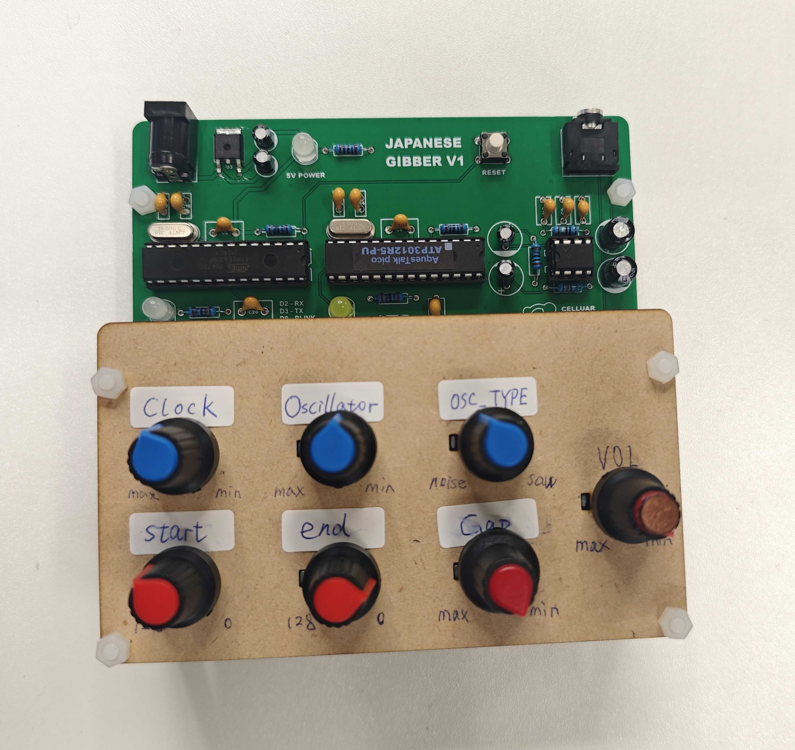

# Japanese_Gibber
A speech synthsizer inspired by Rob's Gibber

"Gibber" is an insteresting instrument with Rob Hordijk's famous [Rungler](https://sdiy.info/wiki/Rob_Hordijk_Rungler) circuit. But it's difficult to rebuild it because of the hardware limitation.
I try to find other possible speech synthesizing chips with phoneme synthesis, but it seems such function is out of date and few manufacturer actually is producing such kind of chip.

But I found a library that achieves such speech synthesis in Arduino Uno (ATmega328) called "Text-to-Speech Library for Arduino" [TTS](https://github.com/jscrane/TTS)
It's superised that we can make phoneme synthesis with Arduino, but the phoneme dataset is only with English. It's not that attractive to re-produced an "English Gibber" which may not as good as orignal one.
However, I found a Japanese phoneme synthesis chip from Akizukidenshi called [ATP3012](https://akizukidenshi.com/catalog/g/g111517/), which actually is a programmed atmega328P.
It can be controlled through Serial and other communication methods according to datasheet. Sadly it doesn't support realtime speed and pitch control. But it will be exicted to hear different language's Gibber.

I programmed the "Rungler" logic according to my understanding on an Atmega328P (Arduino Framework) and use this chip to send commands to ATP3012 through the virtual Serial, so the whole hardware design is pretty simple.
You can build this "Japanese Gibber" easily with accessible components. May be ATP3012 cannot be easily accessed but I believe it still can use "Text-to-Speech Library for Arduino" to build same design in Englich phoneme.
Burn the ".hex" to the chip, and here are the pins I use:

> D2 - RX
> D3 - TX
> D9 - Blink at start
> A0 - Clock frequency
> A1 - Oscillator frequency
> A2 - Oscillator Type
> A3 - Phoneme table start position (0 - 128)
> A4 - Phoneme table end position (0 - 128)
> A5 - Gap length (20 -2000ms) between sentences

